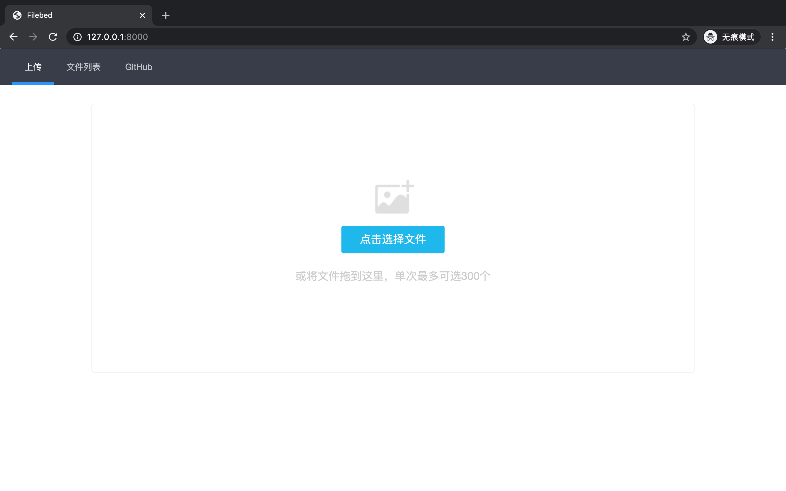
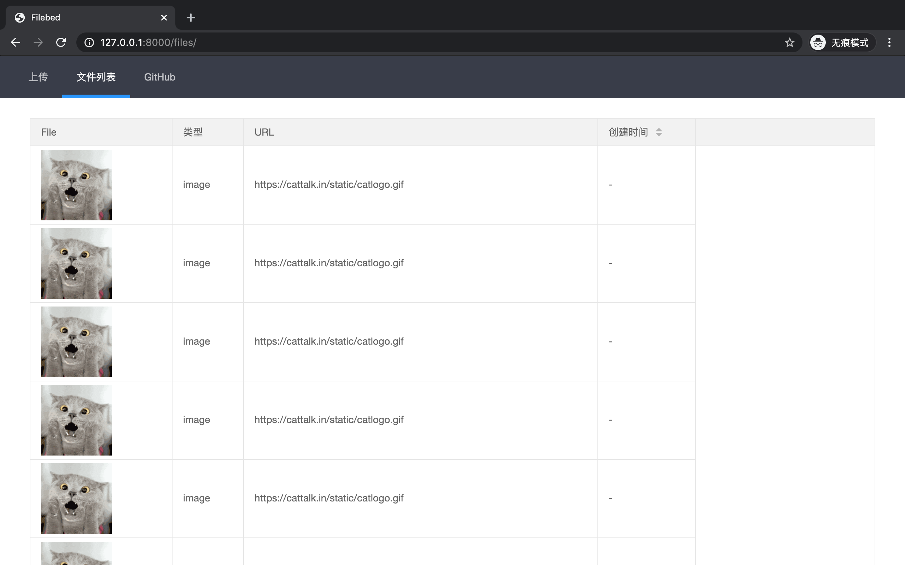

# filebed
file bed





## Stack

- Sanic
- WebUploader

## Install

```shell
git clone https://github.com/istommao/filebed.git

pip install -r requirements.txt

python main.py
```

## Docker

TODO
